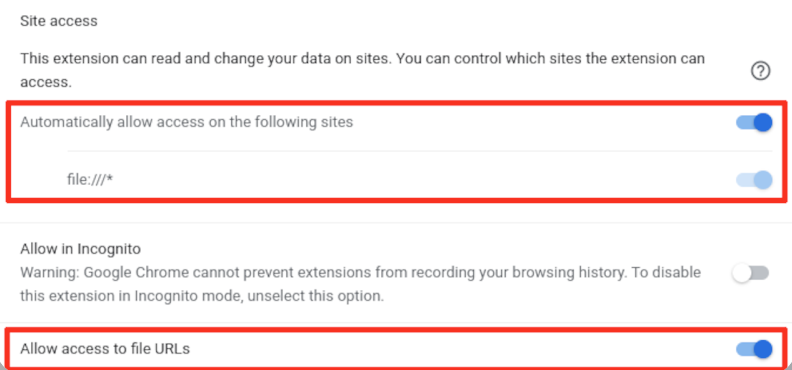

# 📘 How to View Markdown Files in your Browser

Markdown Viewer is a browser extension that allows you to view `.md` (Markdown) files directly in your browser with proper formatting.

## ✅ Step 1: Install the Extension

### For Microsoft Edge:
1. Open Edge and go to the Chrome WebStore.
2. If prompted, enable **Allow extensions from other stores**.
3. Search for **Markdown Viewer**.
4. Click **Add to Chrome** (it will install in Edge) and confirm the installation.

### For Chrome or Chromium-based browsers:
1. Go to the Chrome Web Store.
2. Search for **Markdown Viewer**.
3. Click **Add to Chrome** and confirm the installation.

### For Firefox:
1. Go to the Firefox Add-ons site.
2. Search for **Markdown Viewer**.
3. Click **Add to Firefox** and confirm the installation.

---

## ⚙️ Step 2: Configure the Extension

1. Click the extension icon in your browser toolbar.
2. Open the **Options** or **Settings** page.
3. Enable the following options:
   - ✅ `Allow access to file URLs`
   - ✅ `Enable GitHub-style rendering` (optional for styling)
4. Save your settings.

---

## 📂 Step 3: Open Markdown Files

1. Open a new browser tab.
2. Drag and drop your `.md` file into the tab **or** use `Ctrl+O` to open a file.
3. The file should render with proper Markdown formatting.

---

## 🛠️ Troubleshooting

- If the file doesn't render:
  - Make sure **"Allow access to file URLs"** is enabled in the extension settings.
  - Try refreshing the tab or restarting the browser.
  - Check if the file has a `.md` extension.

---

## 📎 Tips

- You can customize the theme and font in the extension settings.
- Some extensions support live preview while editing Markdown files.

