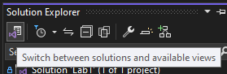
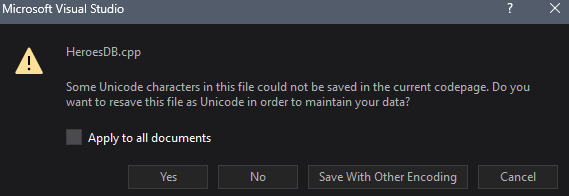

# ❓ General: Frequently Asked Questions

## ❓ Q: I can't find the lab solutions or the lecture solutions anymore. Where are they?

### 💡 A: Switch between solutions in the solution explorer.
If you navigate in file explorer to where you cloned the repo, you'll be able to find the proper folders.

If you are in Visual Studio, you can click the little icon in the top-left of the solution explorer to see all the solutions in the repo. (see the screenshot)

---

## ❓ Q: I'm getting an exception in code that is not mine! How do I fix it?

### 💡 A: Use the call stack to pinpoint the problem

If you see an exception like in the video below, you might be tempted to think your code is not at fault. However, your code is causing the problem. So how do you fix it? You must find the source of the exception in your code. 

If you click `Show Call Stack` on that error you can follow it to the general location of what is triggering that error. Amara has created a video on how to use the call stack.

Link to FAQ on Discord: <a href="https://discord.com/channels/446669518593327105/1268247864157409290/1392954630748639293" target="_blank" rel="noopener noreferrer">Call Stack Overview</a>

---

## ❓ Q: When I save my file, I get an error saying something about the codepage. What should I press?

### 💡 A: Click the "Yes" button.

This might be caused if you copy-paste the pseudo-code into the lab. This is not a big deal. In the dialog (see screenshot), just press the "Yes" button.

