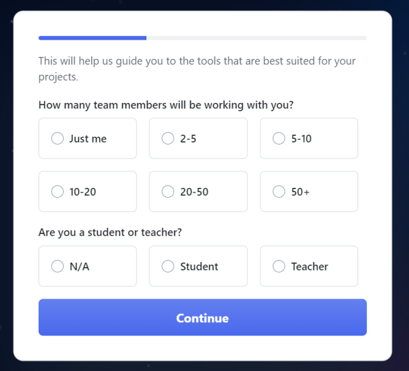
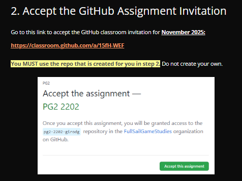
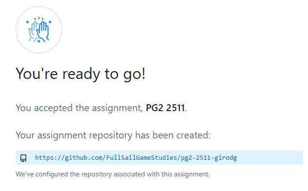
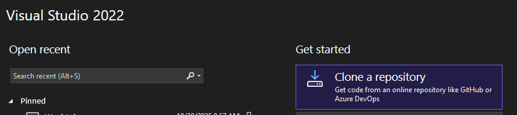
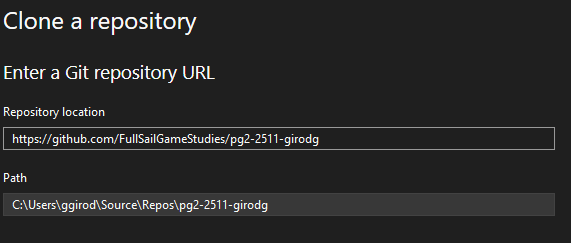
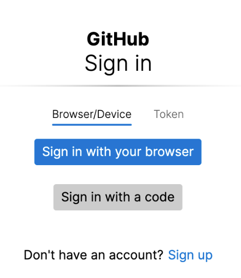
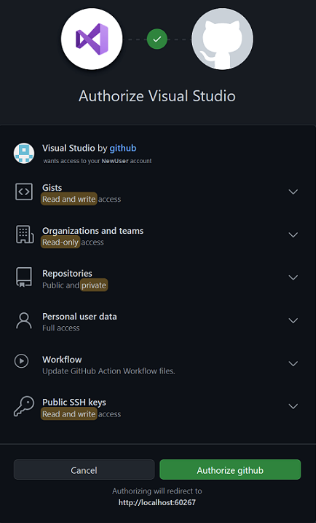
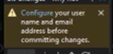
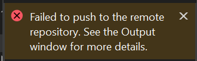
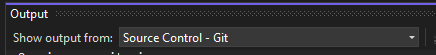

# ❓ GitHub: Frequently Asked Questions
<!--TOC-->
  - [Q: Which email should I use for my GitHub account?](#q-which-email-should-i-use-for-my-github-account)
  - [Q: Can I use a GitHub account that I created before Full Sail?](#q-can-i-use-a-github-account-that-i-created-before-full-sail)
  - [Q: What options should I select when creating my account?](#q-what-options-should-i-select-when-creating-my-account)
  - [Q: How do I accept the GitHub Classroom assignment?](#q-how-do-i-accept-the-github-classroom-assignment)
  - [Q: Can I make my repo public? I want to add it to my portfolio.](#q-can-i-make-my-repo-public-i-want-to-add-it-to-my-portfolio.)
  - [Q: How do I clone the repo?](#q-how-do-i-clone-the-repo)
  - [Q: How do I get my code into my GitHub repo?](#q-how-do-i-get-my-code-into-my-github-repo)
  - [Q: I'm trying to clone the repo but it never finishes. What do I do?](#q-im-trying-to-clone-the-repo-but-it-never-finishes.-what-do-i-do)
  - [Q: My "Commit All" button is disabled. How do I enable it?](#q-my-commit-all-button-is-disabled.-how-do-i-enable-it)
  - [Q: My "Commit All" button is still disabled. How do I enable it?](#q-my-commit-all-button-is-still-disabled.-how-do-i-enable-it)
  - [Q: ERROR: Visual Studio says my repo cannot be found when I try to push. How do I fix it?](#q-error-visual-studio-says-my-repo-cannot-be-found-when-i-try-to-push.-how-do-i-fix-it)
  - [Q: ERROR: Visual Studio says my repo cannot be found when I try to push. How do I fix it?](#q-error-visual-studio-says-my-repo-cannot-be-found-when-i-try-to-push.-how-do-i-fix-it)
  - [Q: ERROR! I get an error message saying I cannot push because my branch is behind. What do I do?](#q-error-i-get-an-error-message-saying-i-cannot-push-because-my-branch-is-behind.-what-do-i-do)
<!--/TOC-->
## ❓ Q: Which email should I use for my GitHub account?

### 💡 A: Any email you want
You can use any email you want. You can even add multiple email accounts to your GitHub account.

---

## ❓ Q: Can I use a GitHub account that I created before Full Sail?

### 💡 A: Yes!

Yes. You can use an already created account.

---

## ❓ Q: What options should I select when creating my account?

### 💡 A: `Just Me` and `N/A`
When GitHub asks you which options to select for your account (see screenshot), select `Just me` and `N/A`.

---

## ❓ Q: How do I accept the GitHub Classroom assignment?

### 💡 A: Click the link supplied in the FSO assignment.
In the FSO assignment, find the link to accept the GitHub Classroom Assignment and click it!

When you click the link, GitHub classroom will create a repo for you using the PG2 materials for the month.
You should see a page like this:

---

## ❓ Q: Can I make my repo public? I want to add it to my portfolio.

### 💡 A: No. Your repo should be private.
Unfortunately, you should not make your PG2 code public. That would be considered a violation of academic honesty policy.

---

## ❓ Q: How do I clone the repo?

### 💡 A: Use the link supplied by GitHub Classroom to clone the repo in Visual Studio.
1) Copy the link you get when the GitHub Classroom finishes creating your repo (see screenshot).

2) Open Visual Studio. Click the "Clone a repository" button.

3) Paste the link into the "Repository Location" box. Select an empty folder on your hard drive for the "Path" box.

4) Click the "Clone" button.

---

## ❓ Q: I'm trying to clone the repo but it never finishes. What do I do?

### 💡 A: Authorize Visual Studio
If the cloning repo message never goes away, there is likely a dialog box somewhere asking you to signin and authorize github in visual studio. Look for dialogs like these.

- Click the "Sign in with your browser"
- Click the green Authorize button.

---

## ❓ Q: How do I get my code into my GitHub repo?

### 💡 A: You need to commit + push your changes
> Make changes to code in the local repo on your hard drive. The files changed MUST be in the folders where you cloned the repo.

To get your code into the remote repo (GitHub), open the `Git Changes` tab in Visual Studio. From the Visual Studio menu, select `View->Git Changes`. 
You should see some files listed in the right side panel of Visual Studio.

To commit + push your code to GitHub, you need to do the following... (refer to the screenshot)

1. Enter a commit message in the text box.
2. Click the Commit All button.
3. Click the Push button (the up arrow). This will copy the code to the remote repo (GitHub)

#### ▶️ Committing and Pushing Video
There is a video in the FSO version of this question. 
- Go to your PG2 course in FSO
- Navigate to the `Frequently Asked Questions` module
   - open the `GitHub Questions` assignment
   - find the question `How do I get my code into my GitHub repo?`

---

## ❓ Q: My "Commit All" button is disabled. How do I enable it?

### 💡 A: There might be a few reasons why...

- You haven't made any file changes. The button is disabled until you've made changes to any files in the local repo.
- If you see a message in the Git Changes tab saying to "Configure" (see screenshot), then click the configure link and fill out the dialog that shows.
- It's a refresh issue. Try closing and reopening visual studio.

---

## ❓ Q: My "Commit All" button is still disabled. How do I enable it?

### 💡 A: Finish configuring GitHub in Visual Studio
You might not see the configure link in your Git Changes tab. You can still get to dialog to make the appropriate changes.

1. From the Visual Studio menu, select "Git > Settings..."
2. Enter the User name and Email that you used for GitHub.

 

---

## ❓ Q: ERROR: Visual Studio says my repo cannot be found when I try to push. How do I fix it?

### 💡 A: You need to configure Visual Studio to use the correct GitHub account

If Visual Studio says that your repo cannot be found when trying to commit + push, then your Visual Studio might be using the wrong GitHub credentials.

1. From the Visual Studio menu, select File > Account Settings...
2. A dialog will show all of the linked accounts in Visual Studio. 
   - If you see a GitHub account that is different than the one used for PG2, then you'll need to remove it.
   - Use the "Add" button to then add the GitHub account credentials that you used when accepting the GitHub Classroom assignment for PG2.

   

---

## ❓ Q: ERROR: Visual Studio says my repo cannot be found when I try to push. How do I fix it?

### 💡 A: Depends on the cause...

If you get an error like the screenshot below, check the Visual Studio Output window. If you don't see the output window, open it from Visual Studio's menu View > Output.

In the output window, change the dropdown to "Source Control - Git".

#### Solutions for a problem adding a zip file that is too big
If you see a message in the output window that says some zip file has exceeded GitHub's file size limit of 100.00MB, then you will need to do one of the solutions below...

##### Solution 1:
1. delete the zip file on your hard drive
2. create a new commit in visual studio
3. SQUASH the commits starting from the commit that is broken to the newest commit. see this on how to squash commits: https://learn.microsoft.com/en-us/visualstudio/version-control/git-manage-repository?view=vs-2022#merge-commits-squash

##### Solution 2:
1. clone your repo to a new location on your drive.
2. copy the new code from the old location to the new location
3. do NOT copy the zip and do not manually zip your repos
4. use the new repo location moving forward

#### Solutions for a problem with your email address on your GitHub account
If you do NOT see an error message about a zip file, then it might be a problem with your email address on your GitHub account.

##### Solution:
- Make sure the email address is NOT private.
> Go to your GitHub account in GitHub. Check your profile and make sure that the "make email private" is unchecked.

---

## ❓ Q: ERROR! I get an error message saying I cannot push because my branch is behind. What do I do?

### 💡 A: You'll need to merge your changes
You might get a message saying your repo is behind the remote repo and needs to be merged.

Use these links to help you resolve any conflicts you might be experiencing with your code and the remote repo:

https://learn.microsoft.com/en-us/visualstudio/version-control/git-resolve-conflicts?view=vs-2022
https://learn.microsoft.com/en-us/visualstudio/version-control/git-manage-repository?view=vs-2022#merge-and-rebase-branches

