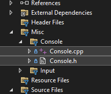
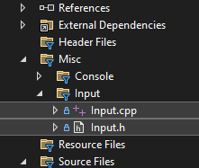

# 📘 Helper Classes

There are 2 helper classes that are provided for the labs: **Input** and **Console**. You’ll find the files under the **Misc/Input** and **Misc/Console** folders in the Solution Explorer.

---

## 🔹 Console Class

The Console class is provided in the labs to make it easier to **print things to the Console window**. You’ll find the class in the labs in the **Misc/Console** folders in Solution Explorer. 
Investigate the **Console.h** file to discover the methods available and how to call them.

### File Location
You can find the Console class declared and defined in the Console.cpp and Console.h files. They can be
located under the Misc/Console folder in the Solution Explorer.




### Console::Write
Console::Write will print the parameter at the current cursor location in the console.
```cpp
//prints "Hello Gotham." 
Console::Write("Hello Gotham."); 

//prints "Hello Gotham." with a foreground color of Yellow and a background color of Cyan.
Console::Write("Hello Gotham.", ConsoleColor::Yellow, ConsoleColor::Cyan);
```

### Console::WriteLine
Console::WriteLine will print the parameter at the current cursor location in the console and then move the cursor to the beginning of the next line.
```cpp
//prints "Hello Gotham." and moves the cursor to the next line
Console::WriteLine("Hello Gotham."); 

//prints "Hello Gotham." with a foreground color of Yellow and a background color of Cyan. 
//Then it moves the cursor to the next line.
Console::WriteLine("Hello Gotham.", ConsoleColor::Yellow, ConsoleColor::Cyan);
```

### Console::SetCursorLeft
Console::SetCursorLeft moves the cursor horizontally to the position as specified by the argument to the method.
```cpp
//moves the cursor to the 15th column (the horizontal x position) in the console
Console::SetCursorLeft(15); 
```

### Console::SetCursorPosition
Console::SetCursorPosition moves the cursor horizontally and vertically as specified by the arguments to the method.
```cpp
//moves the cursor in the console to the 
//5th column (x position) and the 10th row (y position)
Console::SetCursorPosition(5, 10); 
```

### Console::GetWindowWidth
Console::GetWindowWidth returns the horizontal size of the console window.
```cpp
int width = Console::GetWindowWidth(); 
```

### Console::GetWindowHeight
Console::GetWindowHeight returns the vertical size of the console window.
```cpp
int height = Console::GetWindowHeight(); 
```

### Console::Reset
Console::Reset sets the foreground and background colors back to the default values for the console.
```cpp
Console::Reset(); 
```

### Console::Clear
Console::Clear will clear the console window. 
> What this actually does it just scroll the window down to show nothing in the window.
It does not actually remove anything that was printed before calling Clear. If you scroll up, you will still see those items.

```cpp
Console::Clear(); 
```

---

## 🔹 Input Class

The Input class is provided in the labs to make it **easier to get input from the user**. You’ll find the class in the labs in the **Misc/Input** folders in Solution Explorer. 
Investigate the **Input.h** file to discover the methods available and how to call them.

There are 4 methods: **GetString**, **GetInteger**, **GetMenuSelection**, and **PressEnter**. These methods are static therefore to call them you use the Input class name with the :: scope resolution operator.


### File Location
You can find the Input class declared and defined in the Input.cpp and Input.h files. They can be
located under the Misc/Input folder in the Solution Explorer.



### Input::GetString
Will print a message then return the string that the user enters.

```cpp
//prints "What is your name?" and returns the user-entered string
std::string myName = Input::GetString("What is your name?");
```

### Input::GetInteger
Will print a message then return the integer that the user enters.
> NOTE: pass 2 integers for the min and max range for the integer. GetInteger will not return until a number is entered that is within that range.

```cpp
//prints "What is your age?"
//returns the int when the user-entered number is between 0 and 120 (inclusive)
int age = Input::GetInteger("What is your age?", 0, 120);
```

---