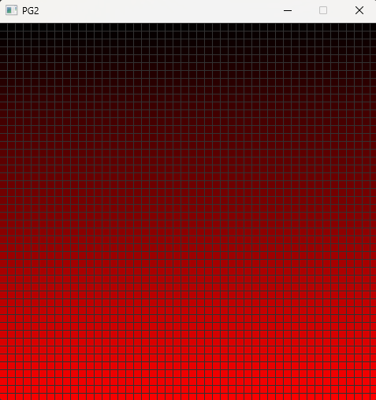

# 📘 Day 04 Lecture Practices

## 💻 Recursion

### 🧩 Part A-1.1: Recursion (Bats)
1. Open `Day4.cpp`
2. Above Day4::PartA_1_1(), write a method called Bats. Convert the following for loop into a recursive loop.
```cpp
			for(int i = 0;i < 100;i++)
			{
				std::cout << (char)78 << (char)65 << ' ';
			}
```
3. Call your Bats method in Day4::PartA_1_1() before the char array line.


### 🧩 Part A-1.2: Recursion (Reverse Word)
1. Open `Day4.cpp`
2. Above Day4::PartA_1_2(), write a recursive method called ReverseWord. The result should print the reverse of the string that is passed in.
3. Call your method in Day4::PartA_1_2() before the cout line.

**Example:**
```cpp
ReverseWord("Batman");
```

**Output:**
```cpp
namtaB
```


### 🧩 Part A-1.3: Recursion (Reverse words in a sentence)
1. Open `Day4.cpp`
2. Above Day4::PartA_1_3(), write a recursive method called ReverseWords. The result should print the words in a sentence in reverse order.
> NOTE: the characters of the words should not be reversed. Only the order of the words.

3. Call your method in Day4::PartA_1_3() *before* the `Console::Write(' ');` line.

**Example:**
```cpp
ReverseWords("The quick brown fox jumps over the lazy dog");
```

**Output:**
```cpp
dog lazy the over jumps fox brown quick The
```

---

## 💻 Sorting

### 🧩 Part A-2: Sorting
1. Open `Sorter.h` and add a method declaration call BubbleSort. The method should sort a vector of Light objects.
> NOTE: open the Light.h file to see the declaration of the Light structure.

2. Open `Sorter.cpp` and write a definition of the BubbleSort method. Translate the following pseudocode to sort the vector.
```cpp
		procedure bubbleSort(A : list of sortable items)
		  n := length(A)
		  repeat
			  swapped := false
			  for i := 1 to n - 1 inclusive do
				  if A[i - 1] > A[i] then
					  swap(A, i - 1, i)
					  swapped = true
				  end if
			  end for
			  n := n - 1
		  while swapped
		end procedure
```
3. Open `Day4.cpp`
4. In the Day4::PartA_2() method, find `case SDLK_2:` and call your BubbleSort method after the `TODO` comment.

#### 🎯 Result:



## 🔭 Markdown Viewer

How to view the markdown files in a browser...
- [Markdown Viewer](../../Shared/0_Setup.md)

---

## 🧠 Lecture Practices

Here are the lecture Practices...
- [Day 4](./Day04.md)
- [Day 5](./Day05.md)
- [Day 6](./Day06.md)

---

## 🔍 Lecture Quizzes

Here are the lecture quizzes...
- [Day 4](https://forms.office.com/r/XUQYr2qrf4)
- [Day 5](https://forms.office.com/r/QRNDCnA8Fw)
- [Day 6](https://forms.office.com/r/pi9bMm1SfR)

---

## Weekly Topics
Here are the topics for the week...
- [Recursion](./1_Recursion.md)
- [Pseudocode](./2_Pseudocode.md)
- [Sorting](./3_Sorting.md)
- [Searching](./4_Searching.md)
- [Maps](./5_Maps.md)
- [Time Complexity](./6_TimeComplexity.md)
