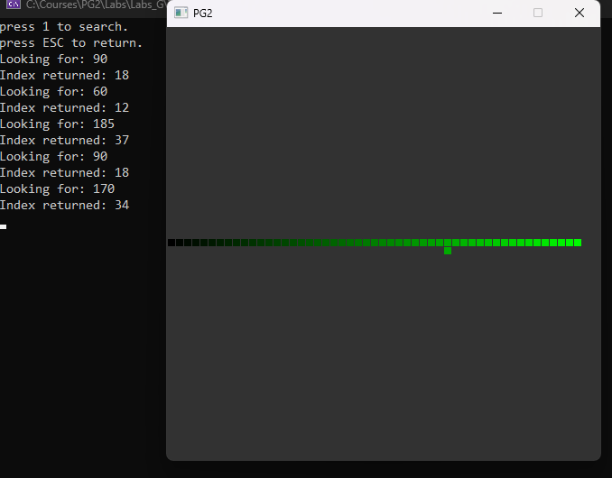
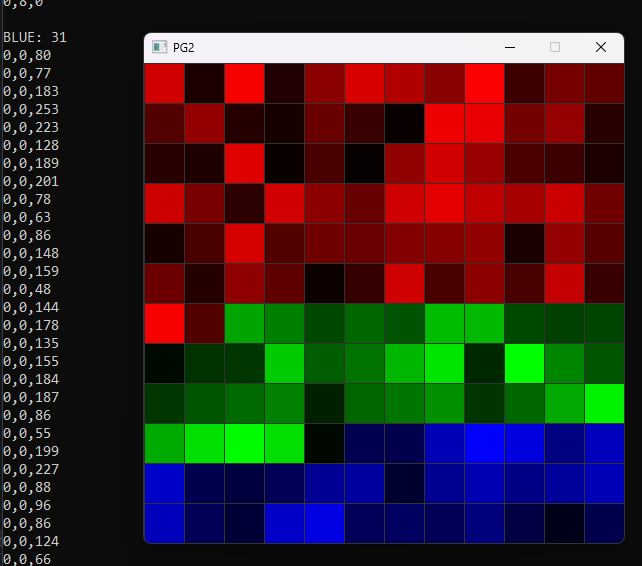
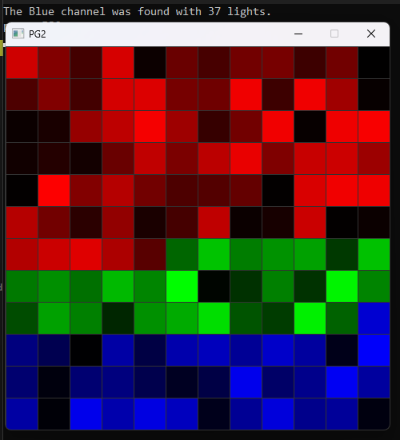

# 📘 Day 05 Lecture Practices

## 💻 Search

### 🧩 Part B-1: Linear Search
1. Open `Searcher.h` and add a method declaration call LinearSearch. The method should search a vector of Light objects for a specific value of the green channel.
> NOTE: open the Light.h file to see the declaration of the Light structure.

2. Open `Searcher.cpp` and write a definition of the LinearSearch method. 
   - linearly search the vector
   - compare the green channel of each object with the green parameter.
   - if the values match, return the index of the light
   - if no match is found, return -1 which indicates that the color was not found.
3. Open `Day5.cpp`
4. In the Day5::PartB_1() method, find `TODO` comment and call your LinearSearch method before the if block. Assign the returned index to the foundIndex variable.

#### 🎯 Result


---

## 💻 Maps

### 🧩 Part B-2.1: Fill the Map
1. Open `Day5.cpp`
2. In the Day5::PartB_2 method, find the comment `TODO: Part B-2.1 fill the std::map`. After the comment...
   - loop over the `allLights` vector.
     - create a temporary ColorChannel variable.
     - check each light. 
     - If the red channel is greater than the blue and green channels, set the ColorChannel variable to RED.
     - If the blue channel is greater than the red and green channels, set the ColorChannel variable to BLUE.
     - If the green channel is greater than the red and blue channels, set the ColorChannel variable to GREEN.
     - call the `groupedColors` map's find method with the ColorChannel variable.
       - if the iterator that is returned equals the `groupedColors' end, then the key is not in the map then...
         - create a new vector with the light.
         - add the vector to the `groupedColors` map for the ColorChannel.
       - else the key is already in the map. then...
         - add the light to the vector for the key.
         > NOTE: the first on the iterator is the key (ColorChannel) and the second on the iterator is the value (vector of lights)

### 🧩 Part B-2.2: Loop over the Map
1. Open `Day5.cpp`
2. In the Day5::PartB_2 method, find the comment `TODO: Part B-2.2 loop over the std::map`. After the comment...
3. Loop over the `groupdColors` map. in the loop for each light...
   - if the color channel is RED, print "RED" and the size of it's vector
   - if the color channel is BLUE, print "BLUE" and the size of it's vector
   - if the color channel is GREEN, print "GREEN" and the size of it's vector
   - Call the `grouper.DrawLights` method.
Example:
```cpp
// the vectorOfLights comes from the map
grouper.DrawLights(screenMap, vectorOfLights, columnRange, column, row); 
```
#### 🎯 Result


### 🧩 Part B-3: Find in Maps
1. Open `Day5.cpp`
2. In the Day5::PartB_2 method, find the comment `TODO: Part B-3 call std::map's find method`. After the comment...
3. Call the `groupedColors` find method to try to find the BLUE ColorChannel.
4. If the BLUE channel is not found, then print to the console that the channel could not be found.
5. else print to the console that the Blue channel was found and print how many lights are in its vector.

#### 🎯 Result



## 🔭 Markdown Viewer

How to view the markdown files in a browser...
- [Markdown Viewer](../../Shared/0_Setup.md)

---

## 🧠 Lecture Practices

Here are the lecture Practices...
- [Day 4](./Day04.md)
- [Day 5](./Day05.md)
- [Day 6](./Day06.md)

---

## 🔍 Lecture Quizzes

Here are the lecture quizzes...
- [Day 4](https://forms.office.com/r/XUQYr2qrf4)
- [Day 5](https://forms.office.com/r/QRNDCnA8Fw)
- [Day 6](https://forms.office.com/r/pi9bMm1SfR)

---

## Weekly Topics
Here are the topics for the week...
- [Recursion](./1_Recursion.md)
- [Pseudocode](./2_Pseudocode.md)
- [Sorting](./3_Sorting.md)
- [Searching](./4_Searching.md)
- [Maps](./5_Maps.md)
- [Time Complexity](./6_TimeComplexity.md)
