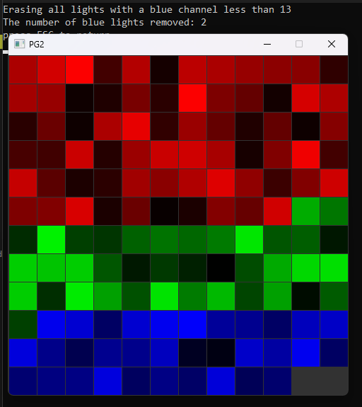

# 📘 Day 06 Lecture Practices

## 💻 Maps

### 🧩 Part C-1: Erase from Maps
We'll utilize the code from Day 5 for the Day 6 Practice.
1. Open `Day5.cpp`
2. In the Day5::PartB_2 method, find the comment `TODO: Part C-1 erasing from a std::map`. After the comment...
3. Call the `groupedColors` find method to try to find the BLUE ColorChannel.
4. If the BLUE channel is not found, then print to the console that the channel could not be found.
5. else, if the BLUE channel is found, then...
   - randomly pick a number from 0 - 255
   - print a message to the console indicating that you'll be erasing all the lights with a blue channel less than 'x'.
   > Example: Erasing all lights with a blue channel less than 57
   - Loop over the vector for the Blue channel
     - if the blue channel is less than the randomly picked value, then erase the light from the vector
     - keep track of how many lights were removed
   - after the loop, print the number of lights that were removed.
   - if the vector for the Blue channel becomes empty, then remove the Blue channel from the `groupedColors` map.

#### 🎯 Result

## 🔭 Markdown Viewer

How to view the markdown files in a browser...
- [Markdown Viewer](../../Shared/0_Setup.md)

---

## 🧠 Lecture Practices

Here are the lecture Practices...
- [Day 4](./Day04.md)
- [Day 5](./Day05.md)
- [Day 6](./Day06.md)

---

## 🔍 Lecture Quizzes

Here are the lecture quizzes...
- [Day 4](https://forms.office.com/r/XUQYr2qrf4)
- [Day 5](https://forms.office.com/r/QRNDCnA8Fw)
- [Day 6](https://forms.office.com/r/pi9bMm1SfR)

---

## Weekly Topics
Here are the topics for the week...
- [Recursion](./1_Recursion.md)
- [Pseudocode](./2_Pseudocode.md)
- [Sorting](./3_Sorting.md)
- [Searching](./4_Searching.md)
- [Maps](./5_Maps.md)
- [Time Complexity](./6_TimeComplexity.md)
