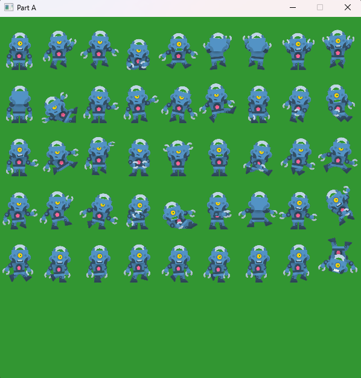
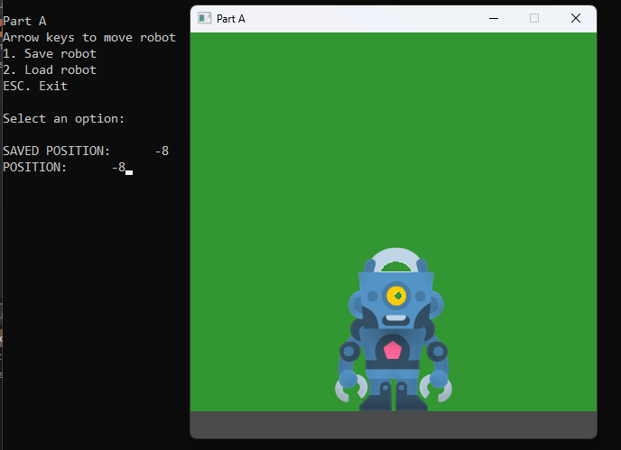
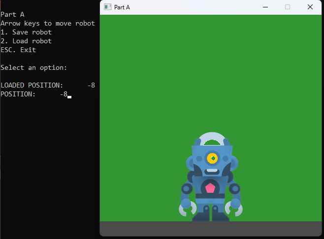

# 📘 Day 10 Lecture Practices

## 💻 Reading CSV Files

### 🧩 Part A-1
1. Open the `Textures.cpp` file
2. Add code to the `LoadSubtextures` method.
   - open the file "character_robot_sheetHD.csv"
   - make sure to check if the file is open before continuing
   - if the file is open...
       - the first line of the file is the name of the image file. Read that into the imageFile_ field of the Textures class.
       - Loop until you reach the end of the file
           - parse each line of the file to get the name, x, y, width, and height of each subtexture.
           - create a SubTexture object with the data from the line.
           - add the SubTexture to the subTextures_ vector of the Textures class.
           - keep track of the maximum width and maximum height of the textures. Store the max width and height in the maxWidth_ and maxHeight_ fields.
       - after looping, be sure to close the file and return true.
   - if the file is NOT open, then print an error message and return false.

#### 🎯 Result

## 💻 Writing CSV Files

### 🧩 Part A-2 SavePosition
1. Open the `Day10.cpp` file
2. Add code to the `SavePosition` method.
3. Open the file for output.
   - if the file is open, 
       - the save the word "position" followed by the worldX. make sure to separate them by the delimiter.
       - print to the console "SAVED POSITION: " and the worldX.
   - else
       - print the file could not be opened.
4. close the file.

#### 🎯 Result

### 🧩 Part A-3 LoadPosition
1. Open the `Day10.cpp` file
2. Add code to the `LoadPosition` method.
3. Open the file for input.
   - if the file is open, 
       - read the line from the file
       - parse the line using getline. Remember that the worldX is the second part of the line.
       - print to the console "LOADED POSITION: " and the worldX.
   - else
       - print the file could not be opened.
4. close the file.
5. return the worldX value.

#### 🎯 Result

## 🔭 Markdown Viewer

How to view the markdown files in a browser...
- [Markdown Viewer](../../Shared/0_Setup.md)

---

## 🧠 Lecture Practices

Here are the lecture Practices...
- [Day 10](./Day10.md)
- [Day 11](./Day11.md)

---

## 🔍 Lecture Quizzes

Here are the lecture quizzes...
- [Day 10](https://forms.office.com/r/tp8VDCWS2P)
- [Day 11](https://forms.office.com/r/tp8VDCWS2P)

---

## Weekly Topics
Here are the topics for the week...
- [CSV](./1_CSV.md)
- [Writing CSV](./2_WritingCSV.md)
- [Reading CSV](./3_ReadingCSV.md)
- [Serializing](./4_Serializing.md)
- [Deserializing](./5_Deserializing.md)
