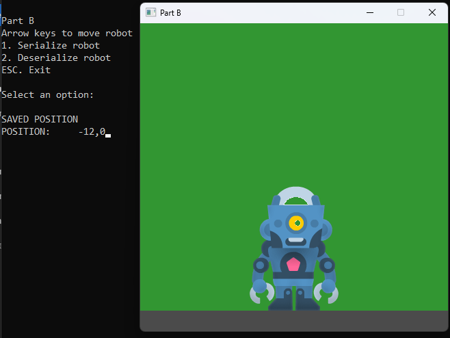
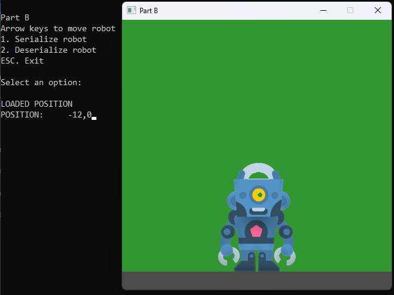

# 📘 Day 11 Lecture Practices

## 💻 Serializing Classes

### 🧩 Part B-1.1: SerializeCSV declaration
1. Open the `Player.h` file
2. Add a declaration for a `SerializeCSV` method to the Player class.
    - parameters: ofstream for the out file, char for the delimiter.
    > remember to consider how parameters should be passed and whether the parameters and method should be const

### 🧩 Part B-1.2: SerializeCSV definition
1. Open the `Player.cpp` file
2. Add a definition for a `SerializeCSV` method to the Player class.
    - write out the player's worldX and worldY. 
    - be sure to separate them by the delimiter.

### 🧩 Part B-1.3: SavePosition method
1. Open the `Day11.cpp` file
2. Add code to the `SavePosition` method.
    - open the file for output
    - if the file is open...
        - serialize the player object
        - print to the console "SAVED POSITION"
    - else print an error message
    - close the file

#### 🎯 Result

## 💻 Deserializing Classes

### 🧩 Part B-2.1: DeserializeCSV declaration
1. Open the `Player.h` file
2. Add a declaration for a `DeserializeCSV` method to the Player class.
    - parameters: csvLine for the line of data, char for the delimiter.
    > remember to consider how parameters should be passed and whether the parameters and method should be const

### 🧩 Part B-2.2: DeserializeCSV definition
1. Open the `Player.cpp` file
2. Add a definition for a `DeserializeCSV` method to the Player class.
    - use getline to parse the csv line parameter
    - the first value on the line is the worldX
    - the second value on the line is the worldY
    - be sure to parse using the delimiter.

### 🧩 Part B-2.3: Player Constructor
1. Open the `Player.h` file
2. Add a Player `constructor` that calls the DeserializeCSV method

### 🧩 Part B-2.4: LoadPosition method
1. Open the `Day11.cpp` file
2. Add code to the `LoadPosition` method.
    - open the file for input
    - if the file is open...
        - read the line from the file
        - call the DeserializeCSV method of the player object
        - print to the console "LOADED POSITION"
    - else print an error message
    - close the file

#### 🎯 Result

## 🔭 Markdown Viewer

How to view the markdown files in a browser...
- [Markdown Viewer](../../Shared/0_Setup.md)

---

## 🧠 Lecture Practices

Here are the lecture Practices...
- [Day 10](./Day10.md)
- [Day 11](./Day11.md)

---

## 🔍 Lecture Quizzes

Here are the lecture quizzes...
- [Day 10](https://forms.office.com/r/tp8VDCWS2P)
- [Day 11](https://forms.office.com/r/tp8VDCWS2P)

---

## Weekly Topics
Here are the topics for the week...
- [CSV](./1_CSV.md)
- [Writing CSV](./2_WritingCSV.md)
- [Reading CSV](./3_ReadingCSV.md)
- [Serializing](./4_Serializing.md)
- [Deserializing](./5_Deserializing.md)
