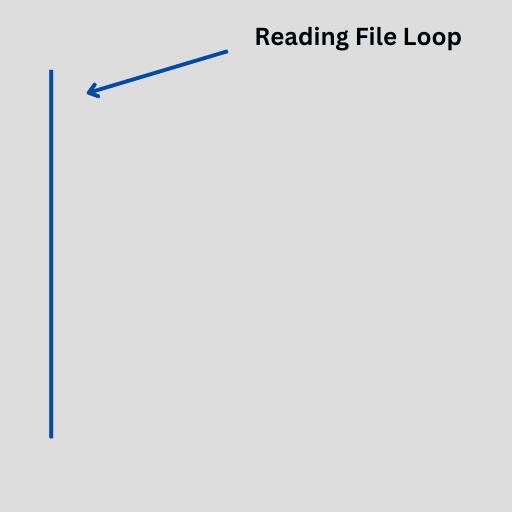

# ❓ Lab 4: Frequently Asked Questions
<!--TOC-->
  - [❓ Q: Do you have any tips for lab 4?](#-q-do-you-have-any-tips-for-lab-4)
  - [❓ Q: I'm getting a build error about a deleted function. What is wrong?](#-q-im-getting-a-build-error-about-a-deleted-function.-what-is-wrong)
  - [❓ Q: Why am I'm getting a build error about << not being defined on the ofstream?](#-q-why-am-im-getting-a-build-error-about-not-being-defined-on-the-ofstream)
<!--/TOC-->
## ❓ Q: Do you have any tips for lab 4?

### 💡 A: Of course! here they are...

#### 📝 Reading & Writing CSVs (Serialization/Deserialization)
* **CSV = Comma Separated Values**
  * Each line = a row of data
  * Each comma = separates a field (like name, health, etc.)
* If you're stuck:
  * **Print out each line** as you read it — does it match the file?
  * **Check for extra whitespace or newlines** messing up your data
  * **Double-check your delimiter** 

#### 🔁 Deserialization (Reading CSV into Objects)
* Think of deserialization as **"taking a line and filling in the blanks"** for an object:
   * Read the line
   * Split it up (on the delimiter)
   * Turn each piece into the right data type (int, float, string, etc.)
   * Use that data to **create an object**
* If it's not working:
   * Are you trying to convert a string to an int but getting a weird result?
   * Are your object values all wrong?
      * Print the fields **before creating** the object to see what you're actually using.

#### 💾 Serialization (Saving Data Back to CSV)
* Serialization = **turning an object back into a CSV line**
   * Grab the class members
   * Format them into a string with commas
   * Write that string to the file
* If you're stuck:
   * Confirm you're writing **one line per object**
   * Make sure fields are in the **right order**
   * Test with a small amount of data first — it's easier to spot mistakes

#### 🧱 Creating Class Objects from File Data
* You’re using the file to **fill out an object’s constructor or setters**
   * Don’t overthink it — treat it like a fill-in-the-blank game:
     * Read → Split → Convert → Pass into object
* Common issues:
   * Forgetting to convert a string to the correct type
   * Mixing up the order of values
   * Passing too few or too many values to the constructor

#### 🔍 Debugging File I/O Stuff

* Add LOTS of print statements
   * What line are you reading?
   * What’s in each field after you split it?
   * What values are being passed to the object?
* Keep the CSV file open in a text editor to cross-check formatting
* Make a **test CSV** with only 2–3 rows to simplify debugging



---

## ❓ Q: I'm getting a build error about a deleted function. What is wrong?

### 💡 A: Use pass by reference
You might be getting a build error like this:
```cpp
error C2280: 'std::basic_ofstream<char,std::char_traits<char>>::basic_ofstream(const std::basic_ofstream<char,std::char_traits<char>> &)': attempting to reference a deleted function
```
The problem is most likely with your serialize method. The problem is you're using pass-by-value.

#### To fix:
Use `pass-by-reference` on the `std::ofstream` parameter.

---

## ❓ Q: Why am I'm getting a build error about << not being defined on the ofstream?

### 💡 A: #include <fstream>
You might be getting a build error like this:
```cpp
error C2676: binary '<<': 'std::ofstream' does not define this operator or a conversion to a type acceptable to the predefined operator
```
This is because you have not #included the fstream header.

#### To fix:
Add `#include <fstream>` to the header where you are using std::ofstream.

---
